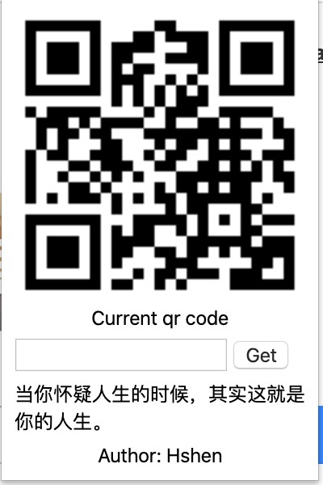

# Qrcode

Chrome 浏览器扩展 - 二维码生成 & 开发工具集

## ✨ 功能特性

### 默认生成当前Url二维码，也可以自定义字符生成二维码，下面是每日一句的毒鸡汤，点击文字可刷新



### 核心功能
- 🔲 **二维码生成** - 一键生成当前页面或自定义文本的二维码
- 🎣 **每日毒鸡汤** - 点击刷新，来自 api.hackshen.com
- 🔧 **开发工具集** - DNS缓存清除、jQuery注入、文件下载
- 🔐 **Cookie 管理** - 右键菜单快速获取/设置 SESSIONID
- 📋 **双击复制** - 页面任意文本双击即可复制

## 🚀 快速开始

### 安装依赖
```bash
npm install
```

### 开发模式
```bash
npm run dev
```

### 生产构建
```bash
npm run build
```

构建产物在 `build/` 目录，可直接加载到 Chrome 扩展程序。

## 📦 技术栈

- **React 18** - UI 框架
- **Ant Design 5** - 组件库
- **Rsbuild** - 构建工具
- **Manifest V3** - Chrome 扩展最新标准

## 🎯 最近更新

**v2.1.0 (2025-01-17) - 配置自动初始化** 🎉

- ✅ **新增：配置自动初始化** - 安装后无需手动保存，默认配置立即生效
- ✅ **新增：智能配置合并** - 更新扩展时自动保留用户自定义配置
- ✅ **优化：用户体验** - 开箱即用，所有功能立即可用
- ✅ **文档：完善指南** - 添加详细的配置管理文档

详见 [CONFIG_INIT_COMPLETE.md](./CONFIG_INIT_COMPLETE.md)

**v1.0.0 (2025-11-09) - 重大升级**

- ✅ 升级到 Manifest V3
- ✅ 移除未使用代码
- ✅ 统一使用 Rsbuild 构建
- ✅ 配置化域名和常量

详见 [UPGRADE_NOTES.md](./UPGRADE_NOTES.md)

## 📖 使用说明

### 快捷键
- Mac: `Command + Shift + S`
- Windows/Linux: `Alt + Shift + S`

### 右键菜单
- **GET SESSIONID** - 获取当前网站的 SESSIONID cookie
- **SET SESSIONID** - 设置之前保存的 SESSIONID

## 🔧 配置

### 自动初始化 ⭐ NEW!

从 v2.1.0 开始，扩展会在安装时**自动初始化默认配置**，无需手动保存！

- ✅ 安装后立即可用
- ✅ 更新时自动保留自定义配置
- ✅ 开箱即用的体验

详见 [配置自动初始化指南](./CONFIG_AUTO_INIT.md)

### 配置文件

所有配置集中管理：
- `src/config.js` - 静态配置（作者信息、快捷链接等）
- `src/dist/default-config.js` - 默认扩展配置（功能开关、API 地址等）
- `src/options.js` - 配置管理界面

配置项包括：
- API 地址
- CDN 链接
- HTTP 规则
- 代理设置
- 功能开关

修改配置后重新构建即可生效。

## 📝 License

MIT

## 👨‍💻 作者

Hshen - [Blog](http://hackshen.com) - [工具库](https://tools.hackshen.com/)
